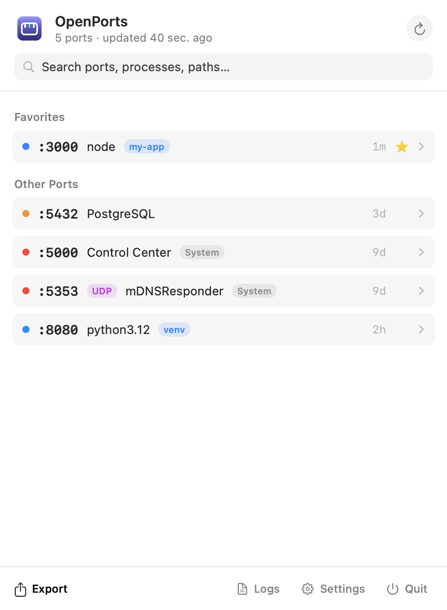
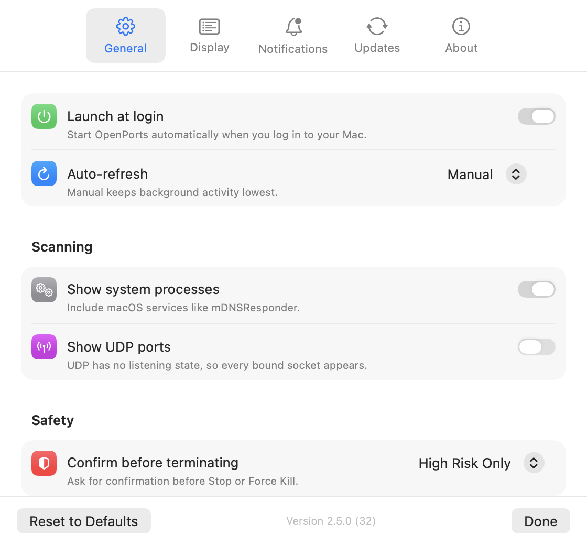

<div align="center">


# OpenPorts

### The port monitor that lives in your menu bar.

**See every listening port. Know exactly which process owns it. Stop it safely — in one click.**

[](https://github.com/MohamedMohana/openports/actions/workflows/ci.yml)
[](https://github.com/MohamedMohana/openports/releases)
[](https://github.com/MohamedMohana/homebrew-tap)
[](https://www.apple.com/macos)
[](https://swift.org)
[](LICENSE)

[Install](#install) · [Tour](#a-60-second-tour) · [CLI](#the-cli-companion) · [Architecture](docs/ARCHITECTURE.md) · [Contributing](#contributing)

<br>

<picture>
  <source media="(prefers-color-scheme: dark)" srcset="docs/assets/popover-dark.png">
  
</picture>

</div>

<br>

## The problem

```
Error: listen EADDRINUSE: address already in use :::3000
```

Every developer knows this moment. What follows is always the same ritual: `lsof -i :3000`, squint at the columns, copy the PID, `kill -9`, hope it wasn't Postgres.

**OpenPorts replaces that entire ritual with one click in your menu bar** — and it stops you *before* you kill something that matters.

## Highlights

| | |
|---|---|
| 🔍 **Everything at a glance** — every listening TCP port (UDP optional), its process, app, PID, and uptime, deduplicated across IPv4/IPv6 | 🛡️ **Safety built in** — every port is classified *Critical / Important / Optional / User-Created*; risky kills ask for confirmation first |
| ⚡ **One-click terminate** — graceful SIGTERM by default, Force Kill when you mean it | 🌗 **Native to the bone** — SwiftUI, follows light/dark mode, adaptive icons, zero Electron |
| ⭐ **Favorites & search** — pin the ports you care about, filter by port, process, app, protocol, or path | 🖥️ **CLI companion** — the same engine in your terminal: `openports-cli`, with table/JSON/CSV output and safe `--kill` |
| 🔔 **Opt-in notifications** — new-port, security, and port-count alerts; *everything off by default* | 🔒 **Private by design** — no telemetry, no accounts; the only network call is the update check you can turn off |
| 🏷️ **Live context** — green **New** badges on fresh ports, uptime on every row, project tags for dev servers (`my-app`, `venv`) | 📤 **Export anywhere** — CSV, JSON, or Markdown in one click |

## Install

```bash
brew install --cask MohamedMohana/tap/openports
```

That's it — the cask installs both the app and the `openports-cli` terminal tool, and in-app updates keep you current.

<details>
<summary><b>Manual install & Gatekeeper note</b></summary>

1. Download the latest zip from [Releases](https://github.com/MohamedMohana/openports/releases)
2. Move `OpenPorts.app` to `/Applications` and launch it

Builds are currently ad-hoc signed, so Gatekeeper shows a one-time warning: right-click the app → **Open**. For the CLI: `xattr -d com.apple.quarantine "$(brew --prefix)/bin/openports-cli"`. (Can you help us notarize? See [CONTRIBUTING.md](CONTRIBUTING.md).)

</details>

## A 60-second tour

1. **Click the port icon** in your menu bar — every listening port, grouped and color-coded
2. **Expand a row** — PID, safety level, uptime, category, executable path, and Stop / Force Kill
3. **Star a port** to pin it to Favorites; **type to filter** by anything
4. **⌘R** refreshes; Settings has auto-refresh from 3–30 s if you prefer hands-off

<div align="center">
<picture>
  <source media="(prefers-color-scheme: dark)" srcset="docs/assets/preferences-dark.png">
  
</picture>
</div>

Settings covers launch at login, UDP scanning, grouping (process / category / app), terminate confirmations, notifications, and one-click Homebrew updates — every option with a plain-English description.

## The CLI companion

The exact same scanning and safety engine, in your terminal:

```console
$ openports-cli
PORT   PROTO  PID    PROCESS    APP             SAFETY        UPTIME
3000   TCP    4211   node       -               User-Created  1m
5432   TCP    80323  postgres   -               Important     1d
5000   TCP    1081   ControlCe  Control Center  Critical      13d

$ openports-cli --kill 3000        # shows the safety warning, asks, then SIGTERMs
$ openports-cli --udp --format json | jq '.[].port'
```

`--format json`/`csv` matches the app's export schema, so scripts and the app always agree.

## Why not just `lsof`?

You absolutely can — OpenPorts uses `lsof` under the hood. What it adds:

- **Context**: app names, bundle resolution, uptime, and project detection instead of truncated command names
- **Judgment**: safety classification and confirmation before you kill something load-bearing
- **Speed**: it's already open in your menu bar, with search, favorites, and history
- **Both worlds**: the GUI for monitoring, the CLI for scripting — one engine, consistent answers

## Privacy

No telemetry. No analytics. No accounts. Port data never leaves your Mac. The single outbound request is the GitHub release check — and you can turn it off in Settings.

## Under the hood

Swift 6.1, SwiftPM, macOS 14+. A strict three-target split: `OpenPortsCore` (all domain logic, no UI imports), the SwiftUI menu bar app, and the CLI — with the scan → resolve → enhance pipeline shared by both front ends. CI runs strict SwiftLint + SwiftFormat, the full test suite, and a packaging smoke test on every PR; tagged releases build both architectures, publish checksummed zips, and update the Homebrew tap automatically.

Read the full story in [docs/ARCHITECTURE.md](docs/ARCHITECTURE.md).

## Roadmap

- [x] UDP view, favorites, search, export, notifications
- [x] CLI companion
- [x] Native UI overhaul, brand refresh, Settings redesign
- [ ] Local-only historical summaries
- [ ] Signed & notarized builds ([help welcome](CONTRIBUTING.md))

Something missing that fits a *lightweight* port monitor? [Open a feature request](https://github.com/MohamedMohana/openports/issues/new/choose).

## Contributing

```bash
git clone https://github.com/MohamedMohana/openports.git
cd openports
swift build && swift test    # 78 tests
./Scripts/lint.sh            # the same checks CI runs
```

Start with [CONTRIBUTING.md](CONTRIBUTING.md) and [docs/ARCHITECTURE.md](docs/ARCHITECTURE.md). Good first contributions: port knowledge-base entries, safety classifications for more services, and localization.

## License

[MIT](LICENSE) — free forever, for everyone.

---

<div align="center">

**If OpenPorts saved you a `kill -9` regret, consider giving it a ⭐ — it helps other developers find it.**

</div>
